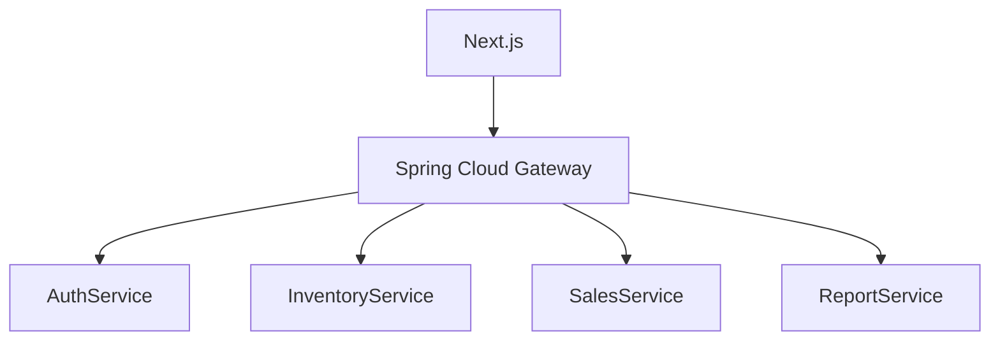
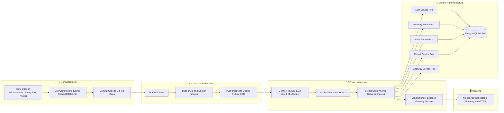

  <h1 style="color: #2c3e50;">SalesFlow</h1>
  
A Comprehensive Sales Management System

---

## 🌟 Key Features

SalesFlow is designed to streamline your sales operations, providing a robust platform to manage everything from suppliers to customers. Here's what makes SalesFlow stand out:

* **User-Friendly Interface:** An intuitive design ensures a smooth experience for all users.
* **Comprehensive Modules:** Covers all essential aspects of sales management.
* **Customizable Reports:** Generate detailed reports to gain valuable insights.
* **Secure Authentication:** JWT-based authentication for enhanced security.

---

## 🏗️ Architecture Features

SalesFlow is built using a modern microservices architecture with the following technologies:

* Spring Boot + Spring Cloud microservices
* PostgreSQL DB
* Kafka for logging and order events
* Docker & Kubernetes for deployment
* AWS S3 for persistence
* GitHub Actions for CI/CD
* Next.js (React) frontend with clean UI per module

---

## 📦 Key Modules

SalesFlow is organized into several key modules, each designed to handle a specific aspect of sales management:

1.  **Auth Service**
    * Handles login, JWT-based authentication, and user roles (ADMIN, SALES\_REP)
    * Registers users and issues secure tokens
    * Key Functionality: Securely manage users and their permissions.
    * Github: https://github.com/SyedMiraj/salesflow-auth-service

2.  **Product & Supplier Service**
    * Manages product catalog
    * Tracks stock levels (inventory)
    * Maintains supplier information
    * Key Functionality: Efficiently manage supplier information and track purchases.
    * Github: https://github.com/SyedMiraj/salesflow-inventory-service

3.  **Sales Service**
    * Handles sales orders and cart management
    * Manages customer details
    * Tracks payments and invoices
    * Updates product inventory after sales
    * Key Functionality: Manage sales orders from creation to delivery.
    * Github: https://github.com/SyedMiraj/salesflow-sales-service

4.  **Report Service**
    * Generates reports: sales summary, daily sales, inventory levels, customer payments, etc.
    * Key Functionality: Get a bird's-eye view of your sales performance with insightful reports.
    * Github: https://github.com/SyedMiraj/salesflow-report-service

5.  **Gateway Service (Spring Cloud Gateway)**
    * Entry point for frontend (Next.js)
    * Routes requests to backend services
    * Handles authentication and authorization with JWT filter
    * Key Functionality: Acts as a single entry point for the application, handling routing and security.
    * Github: https://github.com/SyedMiraj/salesflow-gateway-service

---

## 🧭 System Architecture Diagram

---

## 🛠️ Deployment Lifecycle

This diagram illustrates the complete flow of the Sales Management System from development to deployment using Docker and Kubernetes on AWS EC2. The system includes microservices, CI/CD pipeline, and PostgreSQL running in a container within the Kubernetes cluster.

---

## 📄 License

[MIT](LICENSE)

---

## 📞 Contact

For any questions or support, please contact us at [smiraj2507@gmail.com](mailto:smiraj2507@gmail).

---

  
Thank you for using SalesFlow!

