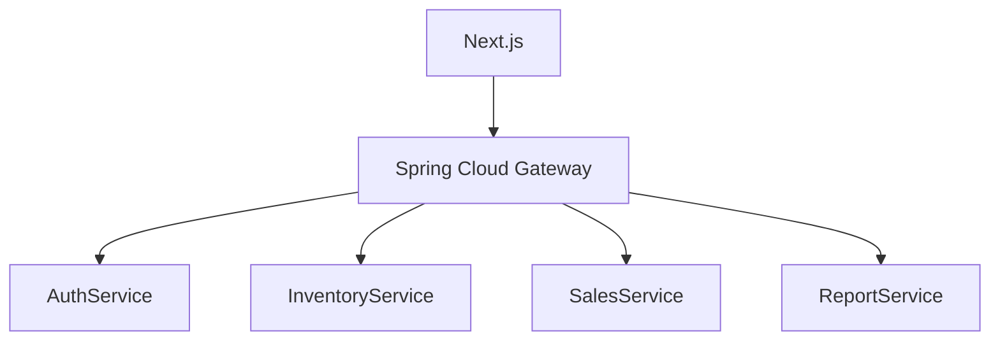

# 📦 Low-Level Design (LLD) for Sales Management System

This document contains detailed low-level design (LLD) of the five key microservices in the Sales Management System.

---

## 🔐 Auth Service

**Responsibilities:**
- Handle user registration and login
- Generate and validate JWT tokens
- Support role-based access (ADMIN, SALES_REP)

**Main Functionalities:**
- `/auth/register` — Register a new user (Admin can register Sales Rep)
- `/auth/login` — Authenticate and issue JWT
- `/auth/validate` — Validate JWT token

**Core Classes:**
- `User`: Entity class for user info
- `UserService`: Handles user logic
- `AuthController`: API for login/register
- `JwtProvider`: Issues and validates tokens
- `SecurityConfig`: Configures Spring Security

---

## 📦 Inventory Service

**Responsibilities:**
- Manage products and inventory
- Handle supplier data

**Main Functionalities:**
- `/products` — CRUD operations on products
- `/suppliers` — CRUD operations on suppliers
- `/inventory/{productId}` — View/update inventory

**Core Classes:**
- `Product`: Entity class for products
- `Supplier`: Entity class for suppliers
- `InventoryService`: Handles inventory logic
- `ProductController`: APIs for product management
- `SupplierController`: APIs for supplier management

---

## 🛒 Sales Service

**Responsibilities:**
- Handle customer and order operations
- Manage payments and invoices

**Main Functionalities:**
- `/orders` — Create, update, view sales orders
- `/customers` — CRUD on customers
- `/payments` — Handle payments and link to order
- `/invoices` — Generate/view invoices

**Core Classes:**
- `SalesOrder`: Entity for order
- `OrderItem`: Line items for orders
- `Customer`: Entity for customer
- `Payment`: Payment entity
- `Invoice`: Invoice entity

- `SalesService`: Manages sales logic
- `CustomerService`: Customer logic
- `PaymentService`: Payments logic

---

## 📊 Report Service

**Responsibilities:**
- Generate business reports for analysis

**Main Functionalities:**
- `/reports/sales-summary` — Sales summary report
- `/reports/inventory-levels` — View inventory status
- `/reports/customer-payments` — History of customer payments

**Core Classes:**
- `ReportService`: Aggregates data from DB/services
- `ReportController`: APIs for different reports
- `ExportUtil`: Utility class for CSV/PDF generation

---

## 🚪 Gateway Service

**Responsibilities:**
- Front-door to the system (Next.js connects here)
- Routes traffic to microservices
- Enforces JWT-based security

**Core Functionalities:**
- Route mapping via `application.yml`
- `AuthenticationFilter` to validate JWT tokens
- CORS config for frontend access

**Example Routes:**
```yaml
- id: auth-service
  uri: lb://AUTH-SERVICE
  predicates:
    - Path=/auth/**
  filters:
    - AuthenticationFilter

- id: inventory-service
  uri: lb://INVENTORY-SERVICE
  predicates:
    - Path=/products/**, /suppliers/**, /inventory/**
  filters:
    - AuthenticationFilter
```

---

## 🗂️ Common-lib Module

A shared library for DTOs, Enums, and utilities used across services.

**Includes:**
- DTOs (UserDto, ProductDto, OrderDto, etc.)
- Enum types (RoleType, PaymentStatus, etc.)
- Utility classes (DateUtil, TokenUtil, etc.)

---

## 🧭 System Architecture Diagram



---

## ✅ Summary

Each service is independently deployable, secured with JWT, and communicates through REST APIs via Gateway. Common data models are centralized in a shared `common-lib` module.


https://flaterptech.com/#linkAppPurchase
